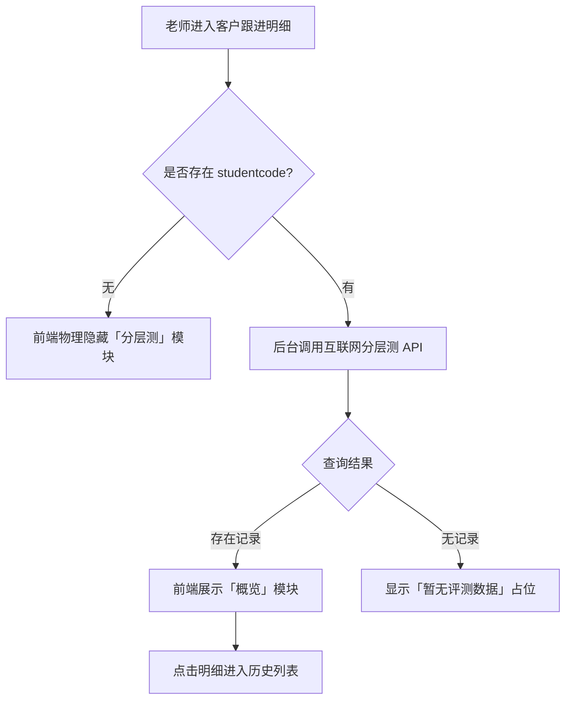
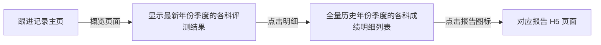
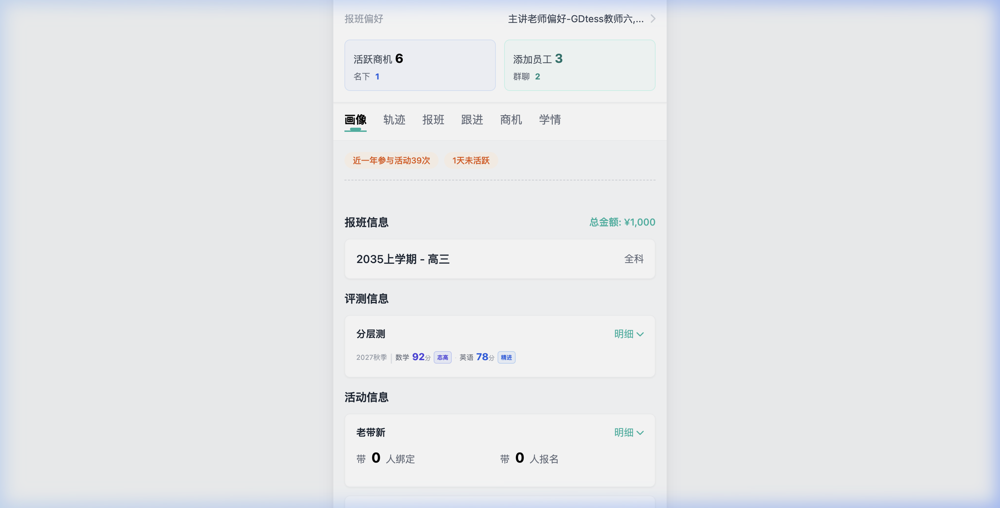
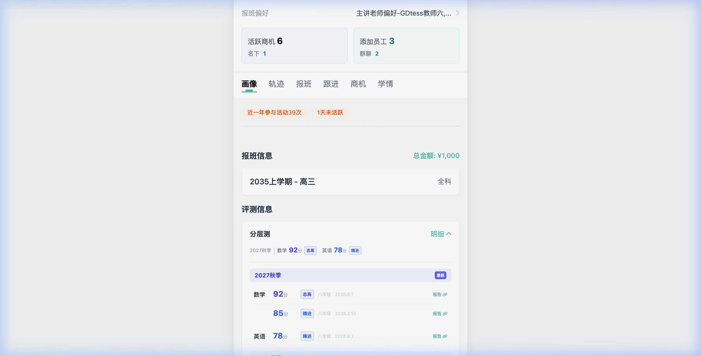

# PRD: 分层测数据集成 (互联网分层测活动)

## 1. 文档修订记录
| 版本 | 日期 | 作者 | 修改内容 |
| --- | --- | --- | --- |
| v1.0 | 2026-04-08 | AI Assistant | 初版：定义互联网分层测活动数据集成方案 |

## 2. 项目背景与目标
- **背景**：分层测代表了学员在新东方的阶段性测试成绩。老师在「客户跟进」时需要直观了解学员的真实学术水平及其**成绩变化趋势**。目前数据分散，老师无法在跟进时快速对比学员的历史表现。
- **目标**：在「客户跟进」明细中集成「分层测」模块，实时展示学员在分层测活动中的**最新评测数据及其历史成绩曲线**，量化展示学员的进步或波动，赋能老师精准关怀，提升老师对学员的洞察力

## 3. 用户角色与场景
| 角色名称 | 职责 | 系统权限 |
| --- | --- | --- |
| 推广老师 | 跟进线索，转化报名 | 可查看名下学员的跟进明细及评测历史 |

- **用户故事**：作为**推广老师**，我想在查看学员跟进详情时，**直接看到该学员的考试成绩变化情况**，以便于我根据其进步速度给家长提供更具说服力的续费或报课方案。

## 4. 业务流程图

## 5. 页面交互流程图 (Page Flow)
> **位置说明**：集成在「客户跟进 -> 个人资料/跟进记录」页面的显著位置。

## 6. 功能需求详情

### 6.1 前端交互展示
- **入口位置**：集成在「客户跟进 -> 画像 - >评测信息」。
- **页面原型**：[点击直达 v1.1 画像评测模块预览](https://tangtang-prototype.netlify.app/customer/v1.1)

#### 交互视觉参考：
| 概览态 (Summary) | 明细态 (History) |
| :---: | :---: |
|  |  |

- **展示策略**：若学员 `studentcode` 字段不存在/为空，前端需物理隐藏分层测挂件。
- **展示元素 (概览态)**：
  - **最近评测结果**：展示系统能查询到的该学员**最近一次考试日期**所对应的各科评测成绩。
  - **科目结果简述**：展示科目名称、对应分数、**资格**（志高、精进、好学）。
- **展示元素 (明细态)**：
  - 点击「明细」后展开全量历史记录，采用 **“评测时间绝对倒序”** 排版：
    1. **时间绝对优先**：年份季度批次，科目记录，同科目考试成绩，排序均严格基于 “评测时间绝对倒序”。在最新的评测时间的年份季度上标记“最新”标签
    2. **考试批次聚合**：数据按时间排序的基础，同一科目、年份季度的按科目、年份季度聚合展示。
    3. **加载与更多**：**默认仅展示最近 2 个年份季度的数据记录；若仍有数据，显示“点击查看更多”按钮，点击后加载后续记录。**
    4. **具体字段展示**：每条记录展示：科目、分数、资格、年级、评测时间、报告（点击跳转 h5 报告）。
  - **数据跨度要求**：明细模块仅展示**近三年内**产生的评测历史数据。
- **样式规范**：
  为区分不同**资格**的学术层级，建议采用以下色彩体系进行标签渲染：
  - **志高**：采用 **靛蓝色 (Indigo)**，底色浅蓝，文字深靛蓝。
  - **精进**：采用 **标准蓝色 (Blue)**，底色浅青，文字深蓝。
  - **好学**：采用 **琥珀色/黄色 (Amber)**，底色浅黄，文字深橙。

### 6.2 后台逻辑 (API 数据规范)
- **数据源**：由互联网端提供 OpenAPI。
- **关键查询参数**：`studentcode` (必填)。
- **数据排序规则**：后台返回数据时需预先按 `evaluation_date` **降序排列**。
- **数据过滤规则**：仅保留最近 3 个自然年度内的记录。
- **字段映射**：
  - `subject` → 科目名称
  - `score` → 考试得分
  - `level_name` → **资格**
  - `grade_name` → 评测时所在年级
  - `evaluation_date` → 评测日期
  - `report_h5_url` → 报告 H5 详情链接

### 6.3 异常处理
- **接口加载失败**：提示“数据获取异常，请重试”。
- **无匹配数据**：提示“该学员暂无分层测数据”。

## 7. 非功能性需求
- **性能**：首屏加载时，分层测概览数据的拉取需在 1.5s 内响应。
- **复用性**：组件需支持在不同终端（H5/小程序）保持布局一致。

## 9. 附录/术语表
- **资格**：新东方分层测评体系中输出的课程推荐逻辑，如：志高、精进、好学等。
- **studentcode**：标识学员身份的唯一编码。
- **前端页面对照原型**：[https://tangtang-prototype.netlify.app/customer/v1.1](https://tangtang-prototype.netlify.app/customer/v1.1)
