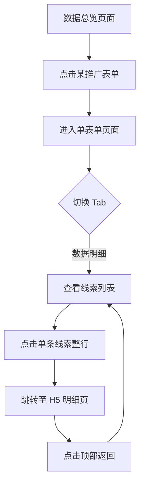
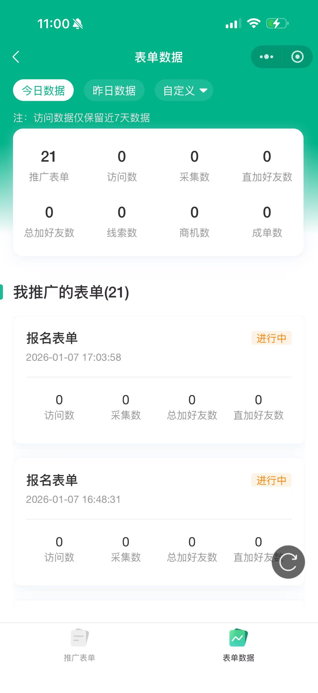
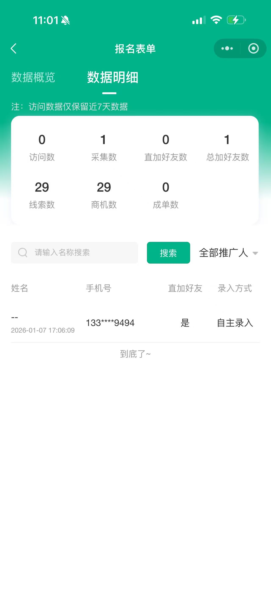
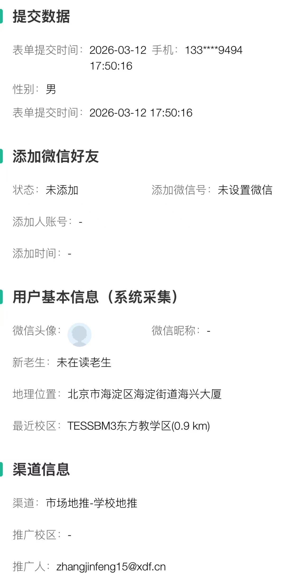

# PRD: 小表单线索明细交互

## 1. 文档修订记录
| 版本 | 日期 | 作者 | 修改内容 |
| --- | --- | --- | --- |
| v1.0 | 2026-04-01 | AI Assistant | 根据最新 generate-prd 规范，重构结构，并补充页面交互流程图 (Page Flow) |

## 2. 项目背景与目标
- **背景**：在当前的推广场景中，老师只能在移动端查看表单的总览和线索明细列表，无法在移动端直接核对单条线索详尽的提交字段、加微情况以及底层系统采集的数据，存在跟踪链条断裂的问题。
- **目标**：打通“数据明细列表”至“单条线索明细”的底层链路，为老师提供直接查看、核对用户全貌信息的能力，从而提升线索跟进效率。

## 3. 用户角色与场景
| 角色名称 | 职责 | 系统权限 |
| --- | --- | --- |
| 推广老师 | 小表单内容分发者、获客承接人 | 可查看自身名下推广的表单数据及对应的线索明细 |

- **用户故事 1**：作为推广老师，我想在「数据明细」列表中点击具体的记录，以便于我进入明细页查看详情。
- **用户故事 2**：作为推广老师，我想在线索明细页中完整看到用户的提交数据和加微状态，以便于我判断线索质量并实施跟进动作。

## 4. 业务流程图

## 5. 页面交互流程图（Page Flow）
> **开发提示**：以下展示了不同界面的跳转链路。

  <table style="border: none; text-align: center;">
    <tr>
      <td style="border: none;"></td>
      <td style="border: none; vertical-align: middle; font-size: 24px;">➡️</td>
      <td style="border: none;"></td>
      <td style="border: none; vertical-align: middle; font-size: 24px;">➡️</td>
      <td style="border: none;"></td>
    </tr>
    <tr>
      <td style="border: none;"><b>1. 数据总览</b> 点击某个表单</td>
      <td style="border: none;"></td>
      <td style="border: none;"><b>2. 单表单数据明细</b> 点击列表某一行</td>
      <td style="border: none;"></td>
      <td style="border: none;"><b>3. 进入线索明细页</b> 查看完整线索记录</td>
    </tr>
  </table>

## 6. 功能需求详情
- **前端交互**：
  - **入口与触发**：进入“某表单 -> 数据明细” Tab后，线索列表的**每一行整体**均需响应点击事件。
  - **页面跳转**：跳转至 H5 端线索明细，路由前缀参考：`https://m.xdf.cn/opt-market/#/pages/detail/index?id={线索ID}`。该页面只需嵌入或平滑跳转，保持与 H5 原有UI一致。
  - **页面返回**：在线索明细页中点击返回按钮，必须精准返回到对应的「数据明细」Tab下（保留之前列表的筛选和滚动位置）。
- **后台逻辑**：
  - 列表接口需下发对应每一条记录全局唯一的线索 ID。
- **异常处理**：
  - 若失效则提示“该线索不存在”或无数据的反馈占位图，并提供“返回列表”操作。

## 7. 非功能性需求
- **性能**：整体响应时间需控制在 1.5 秒以内，返回列表时不应产生不必要的大量接口重请求（保留路由与状态缓存）。
- **安全性**：跳转至 H5 端线索页时继承鉴权信息；越权访问时拦截。

## 8. 数据埋点需求

## 9. 附录/术语表
- **H5 端数据明细**：现有的基于 Web 实现的用户线索库平台明细详情页。
- **线索ID**：数据库层面每一条单据的全局唯一标识。
