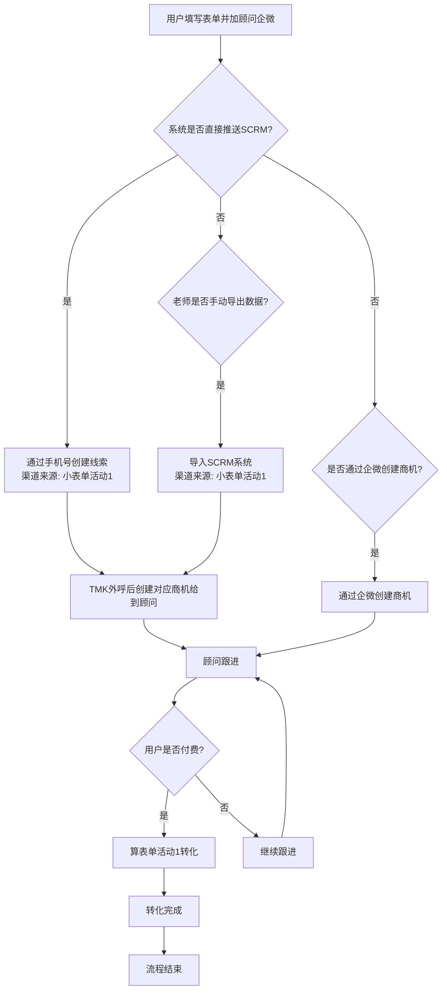

# 小表单线索流转业务流程图

## 流程概述

小表单线索流转业务流程主要聚焦于表单活动的转化情况，包含三种主要转化路径，最终都以用户付费作为转化成功的标志。

## 详细流程

## 流程说明

1. **初始阶段**：用户填写表单并添加顾问企业微信

2. **路径一**：系统直接推送SCRM
   - 通过手机号创建线索，渠道来源标记为"小表单活动1"
   - TMK外呼后创建对应商机给到顾问
   - 顾问跟进
   - 用户付费后，算表单活动1转化

3. **路径二**：系统不推送，老师手动导出数据
   - 老师手动导出数据并导入SCRM系统，渠道来源标记为"小表单活动1"
   - TMK外呼后创建对应商机给到顾问
   - 顾问跟进
   - 用户付费后，算表单活动1转化

4. **路径三**：系统不推送，通过企微创建商机
   - 顾问通过企业微信直接创建商机
   - 顾问跟进
   - 用户付费后，算表单活动1转化

5. **转化完成**：用户付费后，标记为表单活动1的转化成功，流程结束

6. **继续跟进**：如果用户未付费，顾问继续跟进，直到用户付费或放弃

## 逻辑闭环

- 所有路径最终都指向用户付费这一转化目标
- 无论通过哪种渠道创建线索或商机，只要最终用户付费，都算表单活动1的转化
- 对于未付费的用户，顾问需要继续跟进，形成完整的业务闭环