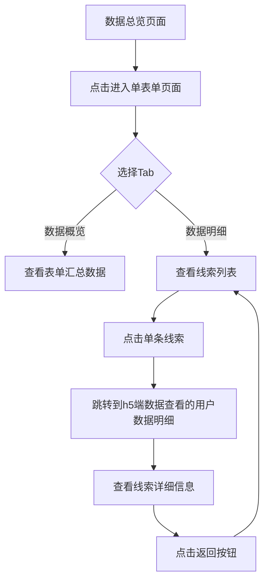

# 小表单线索明细交互流程示意图

## 交互流程概览

以下是小表单线索明细的完整交互流程，从数据总览到线索明细的全过程：

## 交互流程说明

1. **数据总览页面**：老师进入小表单小程序的推广人页面，查看所有推广表单的汇总数据。

2. **单表单页面**：点击某个表单，进入该表单的详细页面。

3. **Tab切换**：
   - 数据概览：查看该表单的汇总指标和推广人数据列表。
   - 数据明细：查看该表单的线索列表，包含姓名、手机号、直加好友、录入方式等信息。

4. **线索明细**：在数据明细列表中点击单条线索，系统跳转到h5端数据查看的用户数据明细页面。

5. **查看详细信息**：在h5页面查看线索的完整信息，包括提交数据、添加微信好友、用户基本信息（系统采集）、渠道信息等。

6. **返回列表**：点击返回按钮，回到数据明细列表页面，继续操作其他线索。

## 技术实现要点

- **小程序端**：负责展示数据总览和数据明细列表。
- **H5端**：负责展示详细的线索信息，使用现有的h5端数据查看的用户数据明细页面。
- **跳转机制**：从小程序跳转到h5页面时，需要传递必要的参数（如表单ID、线索ID）。
- **样式一致性**：h5端用户数据明细页面的样式需与小程序端保持一致，确保用户体验的连贯性。

## 页面链接

- **小程序端**：小表单小程序里推广人页面
- **H5端**：`https://m.xdf.cn/opt-market/#/pages/detail/index?id=76cf86a898c34ad2b60441e54f96d6d4`