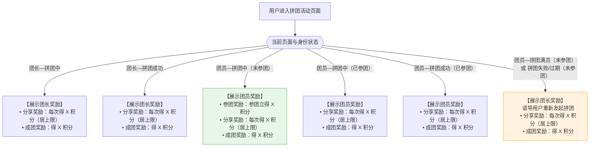
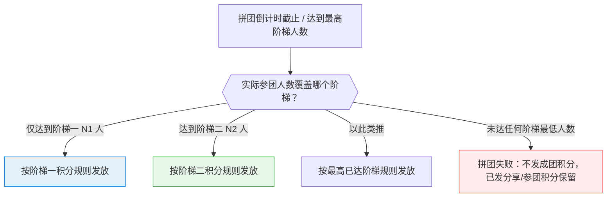
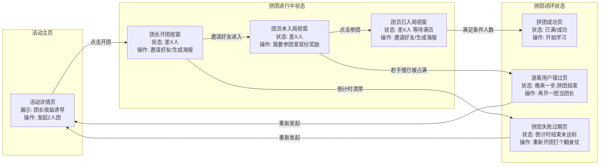

# PRD：小课堂拼团积分奖励功能

## 1. 文档修订记录
| 版本号 | 修订日期 | 修订人 | 修订内容 |
| :--- | :--- | :--- | :--- |
| V1.1 | 2026-04-17 | Antigravity | 新增阶梯拼团支持：后台多阶配置、C端拼团类型选择弹层、分阶积分结算原则（以最终落定阶梯为准）。 |
| V1.0 | 2026-04-16 | Antigravity | 初版产出：完成拼团功能的积分奖励闭环设计、多态展示逻辑及逆向防剥夺原则。 |

---

## 2. 项目背景与目标
* **背景**：当前小课堂的拼团玩法缺乏对参与者（长尾分销节点）的持续刺激。为进一步放大下沉裂变势能，急需引入“新东方之家积分商城”体系，通过高频微小的激励点（分享、参团、成团）促使用户完成关键转化链。
* **目标**：
  * **定性目标**：强化“开团”与“参团拉人”的主动性，将拼团玩法与积分权益深度绑定，形成社交转化的拉力。
  * **定量指标**：提升活动主页的拼团发起率 `+20%`，并在参团后的等待期提升团员的自行分享率 `+15%`。

## 3. 需求参考原型链接
为便于各业务线快速对焦，本项目提供了可点击交互的高保真原型：

* **👉 公网测试环境演示地址**：[https://tangtang-prototype.netlify.app/small-class/v1.0/group-buy](https://tangtang-prototype.netlify.app/small-class/v1.0/group-buy)
* **💻 本地开发与联调白盒地址**：[http://localhost:5173/small-class/v1.0/group-buy](http://localhost:5173/small-class/v1.0/group-buy)
  *(注：该链接为前端本地服务地址，仅限研发本机调试时展示所有边界状态的跃迁)*

---

## 3. 用户角色与场景

### 3.0 拼团类型说明

| 类型 | 定义 | 核心特征 |
| :--- | :--- | :--- |
| **普通拼团** | 固定人数，全员享受同一拼团价与积分配置 | 一个价格、一套积分规则 |
| **阶梯拼团** | 多档人数阶梯，人越多价格越低，各阶梯积分奖励独立配置 | N 个阶梯，价格与积分均可独立设定 |

> **阶梯拼团说明**：运营在后台可添加多个阶梯（至少 2 阶），每个阶梯设定「最低成团人数 + 该阶梯拼团价 + 该阶梯团长/团员各项积分奖励」。用户在 C 端发起拼团时，从底部弹层中选择目标阶梯（如「2人团」「5人团」），确认后按所选阶梯规则进入拼团流程。

### 3.1 用户角色定义

| 角色 | 权限与定义 | 说明 |
| :--- | :--- | :--- |
| **团长** | 拼团的发起者 | 主导裂变的人，拥有最高级奖励额度（满员成团获大额积分）。 |
| **团员** | 参与他人拼团的购买者 | 从协助者转变为再裂变者。参团即可获得鼓励积分，分享还有额外积分。 |
| **未参团者** | 游离在待购边缘的游客 | 浏览拼团详情但尚未付款加入的用户（包含看到满员/过期拼团的用户）。 |

### 3.2 用户故事 (User Story)
* 作为 **团长/团员**，我希望在发起邀请分享时立刻获得积分奖励，以便让我觉得拉人这个行为是有即时价值的。
* 作为 **未参团者**，当我点开朋友的链接发现“拼团已满”或“拼团过期”时，我希望能立刻看到自己新开团拿高额积分的提示，以便让我有动力自己做一回团长。
* 作为 **团员**，我希望在刚凑份子时就先拿到一部分参团积分，并在拉满人之后再拿到成团积分，以便让我体验到“步步稳赚”的快感并愿意积极发圈拉人。

---

## 4. 业务逻辑流程图（积分奖励展示规则）



> **设计原则**：当团员错过了当前拼团（满员/失败/过期），系统展示**团长的高额奖励**，诱导其自己发起新团，实现裂变转化的最大化。积分额度均由运营后台配置。

---

## 4.1 阶梯拼团积分结算原则

### 核心原则：以最终落定阶梯为准

阶梯拼团的积分**不按用户启动时选择的目标阶梯发放**，而是**按拼团截止时实际达到的最高阶梯结算**。

> **举例**：运营配置了「2人团（阶梯一）」和「5人团（阶梯二）」，团长邀请共拉到 6 人（含自己），超过阶梯二门槛，最终按**阶梯二的价格与积分规则**结算。



### 阶梯拼团积分发放时序

| 奖励类型 | 触发时机 | 结算依据 | 说明 |
| :--- | :--- | :--- | :--- |
| **参团奖励** | 团员完成下单支付时（即时） | 用户所选阶梯的参团积分配置 | 即时发放，不随最终阶梯变动而补差 |
| **分享奖励** | 每次有效分享行为时（即时） | 当前所在阶梯的分享积分配置 | 每次实时计数，达上限后不再发放 |
| **成团奖励** | 拼团截止后确认最终阶梯，再异步发放 | **以最终落定阶梯为准** | 最终升阶则按更高阶梯的成团积分结算 |

---

## 4.2 普通拼团积分发放时机

| 奖励类型 | 触发时机 | 发放对象 | 备注 |
| :--- | :--- | :--- | :--- |
| **参团奖励** | 团员完成下单支付，参团订单生效时 | 团员 | 仅发放一次；拼团失败也不扣回 |
| **分享奖励** | 用户点击「邀请好友参团」或「朋友圈海报」，系统记录一次有效分享行为时 | 团长 / 团员（各自独立发放） | 每次分享均计数，累计达上限后不再发放 |
| **成团奖励** | 拼团人数达到要求，拼团状态流转为「成功」时 | 团长 / 团员（分别按各自配置发放） | 拼团失败则不发放；已发放的其他积分不受影响 |

> **注：** 以上所有积分均通过钉钉发积分接口（事件回调模型）异步发放，前端发起动作后等待服务端回调更新积分展示，不阻塞主流程。参见：[发送积分接口接入指南](https://alidocs.dingtalk.com/i/nodes/20eMKjyp81RNZrrdfKxkbvbQWxAZB1Gv?utm_scene=team_space)

---

## 5. 页面交互流程图 (Page Flow)



---

## 6. 功能需求详情 (Functional Requirements)

### 6.1 前端 UI 与文案交互
* **C端 角色与状态演变矩阵图（含积分奖励最新版）**：  
  

**0. 阶梯拼团类型选择弹层（仅阶梯拼团展示）**

> 普通拼团无需此弹层，点击开团/参团后直接进入流程。

* **触发时机**：用户点击「X元起 X人开团」或「参团」按钮时，弹出底部浮层（Bottom Sheet）。
* **弹层内容结构**：
  - **顶部**：课程封面缩略图 + 课程名 + 拼团价格范围（如：拼团价 ¥0.00-0.10）
  - **中部**：「拼团类型」标签组，横向排列各阶梯选项（如：`2人团`、`5人团`），选中态高亮
  - **底部**：「确定」按钮，点击后按所选阶梯进入开团/参团流程
* **细节规则**：
  - 默认选中**第一阶梯**（门槛最低）
  - 若某阶梯已满员，该选项显示「已满」置灰，不可选
  - 若整体拼团活动已过期/截止，弹层不弹出，直接展示「重新开团」诱导逻辑

**1. 积分赚取横幅 (Point Rewards Card)**
* **位置**：操作按钮下方，橙色卡片，左侧礼盒图标，右侧附「去兑换」跳转积分商城入口。
* **阶梯拼团说明**：横幅展示的积分数值以**用户已选定（或当前所在）阶梯**的配置为准。
* **各角色与状态下的展示内容**：

| 身份 | 页面状态 | 横幅展示内容 |
| :--- | :--- | :--- |
| **团长** | 拼团中 | 分享好友：每次得 X 积分（封顶 X 积分）；成团奖励：团长得 X 积分 |
| **团长** | 拼团成功 | 分享好友：每次得 X 积分（封顶 X 积分）；成团奖励：团长得 X 积分 |
| **团员** | 拼团中 · 未参团 | 参团奖励：参团立得 X 积分；分享好友：每次得 X 积分（封顶 X 积分）；成团奖励：团员得 X 积分 |
| **团员** | 拼团中 · 已参团 | 分享好友：每次得 X 积分（封顶 X 积分）；成团奖励：团员得 X 积分 |
| **团员** | 拼团成功 · 已参团 | 分享好友：每次得 X 积分（封顶 X 积分）；成团奖励：团员得 X 积分 |
| **团员** | 拼团满员（未参团）或拼团失败/过期（未参团） | 切换展示团长奖励（诱导重新开团）：分享好友每次得 X 积分（封顶 X 积分）；成团奖励：团长得 X 积分 |

> 所有 X 均从后台配置读取；若某项配置为 0 或留空，则前端不渲染该行文案。

**2. 极限异常状态兜底处理**
* **晚来一步（团满拦截）**：标题变更为「! 晚来一步，拼团已结束」，按钮变更为「再开一团」。
* **遗憾过期（时间耗尽）**：倒计时变更为「倒计时已结束，未达到成团人数要求」，操作按钮变更为「重新开团」。

### 6.2 后台接口与管理端配置逻辑
* **B端 运营管理后台截图参考**：  
  

* **底层接口对接**：需与钉钉底层打通发送事件回调模型发放积分：[发送积分接口接入指南](https://alidocs.dingtalk.com/i/nodes/20eMKjyp81RNZrrdfKxkbvbQWxAZB1Gv?utm_scene=team_space)。
* **管理端 B端后台配置要求（活动基础设置新增项）**：

#### 6.2.1 普通拼团积分配置

  在「基础设置 - 拼团类型/价格设定」下方，需下挂扩展一层 **【拼团奖励】** 配置模块：
  * **「团长奖励」** 版块：
    - `分享奖励`：[  ] 积分/次，上限 [  ] 积分（文本输入框，限制正整数）
    - `成团奖励`：[  ] 积分（文本输入框，限制正整数）
  * **「团员奖励」** 版块：
    - `分享奖励`：[  ] 积分/次，上限 [  ] 积分（文本输入框，限制正整数）
    - `参团奖励`：[  ] 积分（文本输入框，限制正整数）
    - `成团奖励`：[  ] 积分（文本输入框，限制正整数）
  * **配置约束**：三项奖励支持并发叠加；若某项留空或填 0，则 C 端不渲染该行文案。

#### 6.2.2 阶梯拼团积分配置

选择「阶梯拼团」后，原全局积分配置**替换**为「每个阶梯独立的积分配置」，UI 结构如下：

```
拼团类型：○ 普通拼团  ● 阶梯拼团

拼团人数：
  第一阶梯人数  [   ]  人
  第二阶梯人数  [   ]  人
  [+ 添加阶梯]

拼团价格：
  原价（元）     第一阶（元）     第二阶（元）
  ¥ XX          ¥ [      ]       ¥ [      ]

拼团奖励：
  ▶ 第一阶 >
    团长奖励
      分享奖励  [  ] 积分/次  上限 [  ] 积分
      成团奖励  [  ] 积分
    团员奖励
      分享奖励  [  ] 积分/次  上限 [  ] 积分
      参团奖励  [  ] 积分
      成团奖励  [  ] 积分
  ▶ 第二阶 >
    团长奖励  ...（同上结构，独立填写）
    团员奖励  ...（同上结构，独立填写）
```

| 配置字段 | 说明 |
| :--- | :--- |
| 阶梯人数 | 第 N 阶的最低成团人数，必须逐级递增；后台做前端校验 N2 > N1 |
| 拼团价（各阶梯列） | 每阶拼团价独立填写；不填则沿用原价 |
| 每阶积分（团长/团员各项） | 与普通拼团字段结构相同，归属对应阶梯；不填或填 0 则 C 端不展示该行 |
| 添加阶梯 | 建议后台硬限制上限 5 个阶梯，防止配置过度复杂 |

### 6.3 异常规则与逆向售后处理 [P0]
* **失败场景保护**：若倒计时结束未成团，系统**不扣除、不回收**该用户在拉取/分享拼团过程中产生的积分（即：发了的积分泼出去的水），降低客诉率和客服结算成本。
* **退款场景保护**：同样，若用户发生售后退团行为，也不进行任何历史活动小额积分的追溯和回收扣除。

---

## 7. 非功能性需求
- **性能体验**：在微信 / 企微 H5 / 小程序环境中，分享图与海报的生成需采用异步不阻塞方式。点击后需立即提供 Toast (如：“正在生成专属海报...”)，提升用户心理预期过渡。
- **并发要求**：“点击参团”接口需做好防重提交与互斥锁逻辑，严禁在“还差1人”时遭遇高并发引起的2人同时写入导致的团员超载漏洞。

---

## 8. 数据埋点与转化率度量
| 埋点位置/事件名称 | 触发时机 | 记录维度参数 | 对应业务目的 |
| :--- | :--- | :--- | :--- |
| `group_buy_expose` | 页面曝光被渲染 | 页面状态(拼团中/失败/已满), 用户身位(团长/团员/未入团), 拼团类型(普通/阶梯) | 观测页面流量漏斗顶层 |
| `click_start_group` | 点击「X元起 X人开团」或「重新开团」 | 拼团类型 | 核算课程详情页到开团意愿层漏斗 |
| `tiered_sheet_show` | 阶梯拼团选择弹层被展示 | 活动 ID | 度量弹层曝光次数 |
| `tiered_option_select` | 用户在弹层中选择某一阶梯 | 选中阶梯序号（1/2/...），对应人数 | 分析用户偏好哪一档阶梯，数据驱动运营定价 |
| `click_join_group` | 游离状态点击「我要参团」时 | 拼团类型, 目标阶梯序号 | 统计团员入局冲动率 |
| `click_share_poster` | 点击「邀请参团」/「生成海报」 | 触发者身份(团长/团员), 当前所在阶梯 | 度量下沉裂变指数（K因子）与积分刺激有效性 |
| `click_points_mall` | 卡片右下侧点击「去兑换」商城 | 用户积分存量 | 看出积分商城作为营销转化抓手的反哺效率 |
| `group_settle_tiered` | 阶梯拼团最终阶梯结算完成 | 最终落定阶梯序号, 实际参团人数, 积分发放总量 | 度量阶梯拼团升阶率与激励投放效率 |
