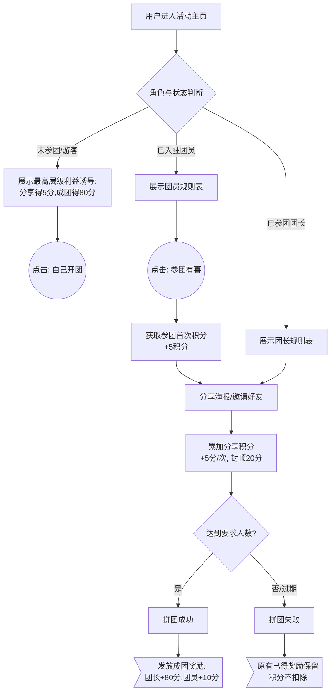
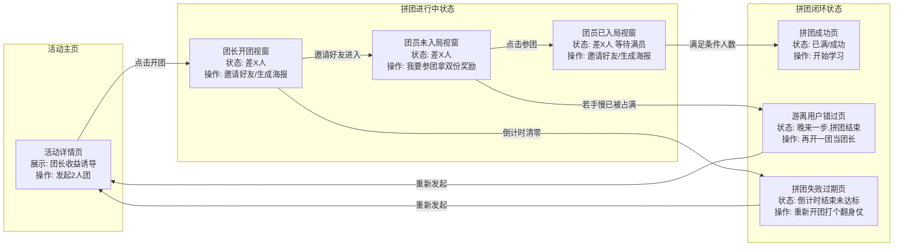
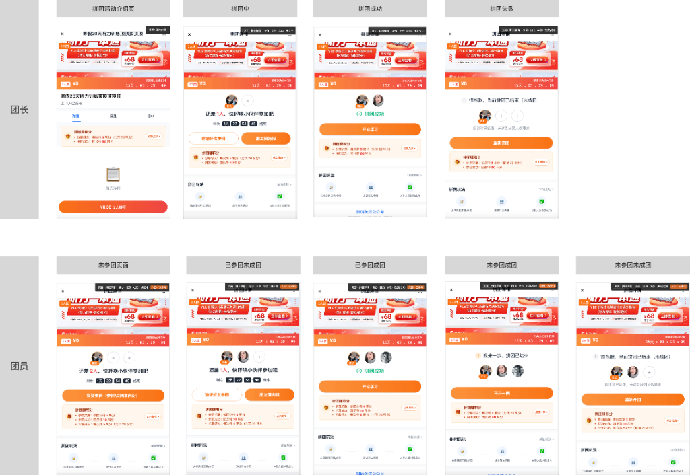
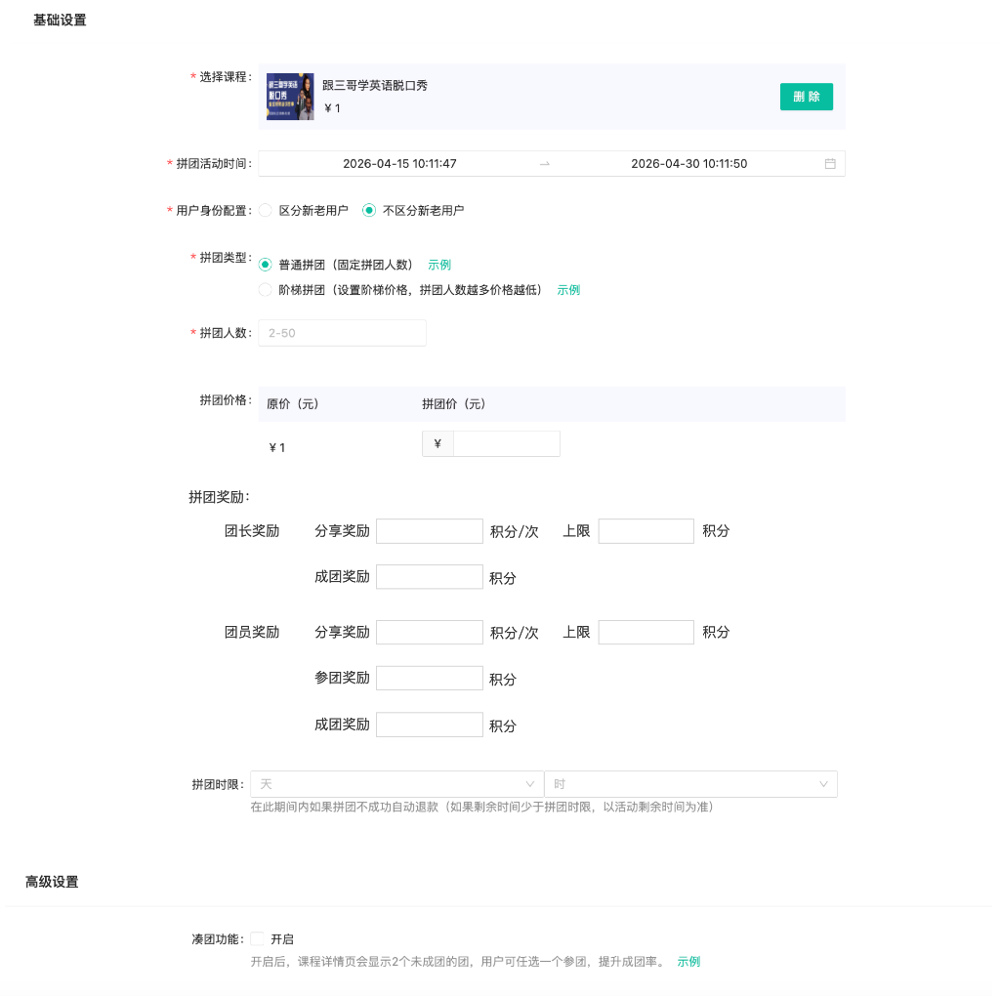

# PRD：小课堂拼团积分奖励功能

## 1. 文档修订记录
| 版本号 | 修订日期 | 修订人 | 修订内容 |
| :--- | :--- | :--- | :--- |
| V1.0 | 2026-04-16 | Antigravity | 初版产出：完成拼团功能的积分奖励闭环设计、多态展示逻辑及逆向防剥夺原则。 |

---

## 2. 项目背景与目标
* **背景**：当前小课堂的拼团玩法缺乏对参与者（长尾分销节点）的持续刺激。为进一步放大下沉裂变势能，急需引入“新东方之家积分商城”体系，通过高频微小的激励点（分享、参团、成团）促使用户完成关键转化链。
* **目标**：
  * **定性目标**：强化“开团”与“参团拉人”的主动性，将拼团玩法与积分权益深度绑定，形成社交转化的拉力。
  * **定量指标**：提升活动主页的拼团发起率 `+20%`，并在参团后的等待期提升团员的自行分享率 `+15%`。

## 3. 需求参考原型链接
为便于各业务线快速对焦，本项目提供了可点击交互的高保真原型：

* **👉 公网测试环境演示地址**：`[请在此处补充部署后的线上预览 URL]`
* **💻 本地开发与联调白盒地址**：[http://localhost:5173/small-class/v1.0/group-buy](http://localhost:5173/small-class/v1.0/group-buy)
  *(注：该链接为前端本地服务地址，仅限研发本机调试时展示所有边界状态的跃迁)*

---

## 3. 用户角色与场景
| 角色 | 权限与定义 | 说明 |
| :--- | :--- | :--- |
| **团长** | 拼团的发起者 | 主导裂变的人，拥有最高级奖励额度（满员成团获大额积分）。 |
| **团员** | 参与他人拼团的购买者 | 从协助者转变为再裂变者。参团即可获得鼓励积分，分享还有额外积分。 |
| **未参团者** | 游离在待购边缘的游客 | 浏览拼团详情但尚未付款加入的用户（包含看到满员/过期拼团的用户）。 |

### 3.1 用户故事 (User Story)
* 作为 **团长/团员**，我希望在发起邀请分享时立刻获得积分奖励，以便让我觉得拉人这个行为是有即时价值的。
* 作为 **未参团者**，当我点开朋友的链接发现“拼团已满”或“拼团过期”时，我希望能立刻看到自己新开团拿高额积分的提示，以便让我有动力自己做一回团长。
* 作为 **团员**，我希望在刚凑份子时就先拿到一部分参团积分，并在拉满人之后再拿到成团积分，以便让我体验到“步步稳赚”的快感并愿意积极发圈拉人。

---

## 4. 业务逻辑流程图

---

## 5. 页面交互流程图 (Page Flow)

---

## 6. 功能需求详情 (Functional Requirements)

### 6.1 前端 UI 与文案交互
* **C端 角色与状态演变矩阵图（含积分奖励最新版）**：  
  

**1. 积分赚取横幅 (Point Rewards Card)**
* **位置**：页面大操作按钮下方，采用桔色预警填充卡片，左侧搭配系统自带 `🎁` 礼盒图标。附带右侧的 `点击兑换 >` 跳转商城按钮。
* **规则文案动态渲染逻辑**：
  * **场景 A**：用户处于“未开团/未参团”、“看到的团已满员(Success+未入团)”、“看到的团已过期(Failed)”等置身事外的状态时，横幅 **强制展示团长最高配置**，以刺激转化：
    * `分享好友：每次得 5 积分（封顶 20 积分）`
    * `拼团成功：团长得 80 积分`
  * **场景 B**：用户已作为团员“下单入局”但未成团（Pending + 已入团）或刚成团（Success + 已入团），展示 **双线并发明细**，鼓励他分享接盘：
    * `参团奖励：参团立得 5 积分`
    * `拼团成功：团员得 10 积分`
    * `分享好友：每次得 5 积分（封顶 20 积分）`

**2. 极限异常状态兜底处理**
* **晚来一步（团满拦截）**：标题变更为 `! 晚来一步，拼团已结束`，按钮变更为金黄色的 `再开一团`。
* **遗憾过期（时间耗尽）**：倒计时栏变更为提示文本 `倒计时已结束，未达到成团人数要求`，原位置头像预留出“+”的空缺，操作按钮变更为 `重新开团`。

### 6.2 后台接口与管理端配置逻辑
* **B端 运营管理后台截图参考**：  
  

* **底层接口对接**：需与钉钉底层打通发送事件回调模型发放积分：[发送积分接口接入指南](https://alidocs.dingtalk.com/i/nodes/20eMKjyp81RNZrrdfKxkbvbQWxAZB1Gv?utm_scene=team_space)。
* **管理端 B端后台配置要求（活动基础设置新增项）**：
  在“基础设置 - 拼团类型/价格设定”下方，需下挂扩展一层 **【拼团奖励】** 配置模块，具体字段设计如下：
  * **「团长奖励」** 版块：
    - `分享奖励`：[  ] 积分/次，上限 [  ] 积分（文本输入框，限制正整数）
    - `成团奖励`：[  ] 积分（文本输入框，限制正整数）
  * **「团员奖励」** 版块：
    - `分享奖励`：[  ] 积分/次，上限 [  ] 积分（文本输入框，限制正整数）
    - `参团奖励`：[  ] 积分（文本输入框，限制正整数）
    - `成团奖励`：[  ] 积分（文本输入框，限制正整数）
  * **配置约束**：团员的这三项奖励支持并发叠加（即全填的话全都生效），不限制为互斥选项；若某项输入框留空或填 0，则前端 C 端的积分横幅上不展示这条规则。

### 6.3 异常规则与逆向售后处理 [P0]
* **失败场景保护**：若倒计时结束未成团，系统**不扣除、不回收**该用户在拉取/分享拼团过程中产生的积分（即：发了的积分泼出去的水），降低客诉率和客服结算成本。
* **退款场景保护**：同样，若用户发生售后退团行为，也不进行任何历史活动小额积分的追溯和回收扣除。

---

## 7. 非功能性需求
- **性能体验**：在微信 / 企微 H5 / 小程序环境中，分享图与海报的生成需采用异步不阻塞方式。点击后需立即提供 Toast (如：“正在生成专属海报...”)，提升用户心理预期过渡。
- **并发要求**：“点击参团”接口需做好防重提交与互斥锁逻辑，严禁在“还差1人”时遭遇高并发引起的2人同时写入导致的团员超载漏洞。

---

## 8. 数据埋点与转化率度量
| 埋点位置/事件名称 | 触发时机 | 记录维度参数 | 对应业务目的 |
| :--- | :--- | :--- | :--- |
| `group_buy_expose` | 页面曝光被渲染 | 页面状态(拼团中/失败/已满), 用户身位(团长/团员/未入团) | 观测页面流量漏斗顶层 |
| `click_start_group` | 点击“X元 X人开团” 或 “重新开团” | -- | 核算课程详情页到开团完成的意愿层漏斗 |
| `click_join_group` | 游离状态点击“我要参团”时 | -- | 统计团员入局冲动率 |
| `click_share_poster` | 点击"邀请参团" / "生成海报" | 上报触发者身份 (团长? 团员?) | 度量下沉裂变指数（K因子）与积分刺激有效性 |
| `click_points_mall` | 卡片右下侧点击“去兑换”商城 | 用户积分存量 | 看出积分商城作为营销转化抓手的反哺效率 |
